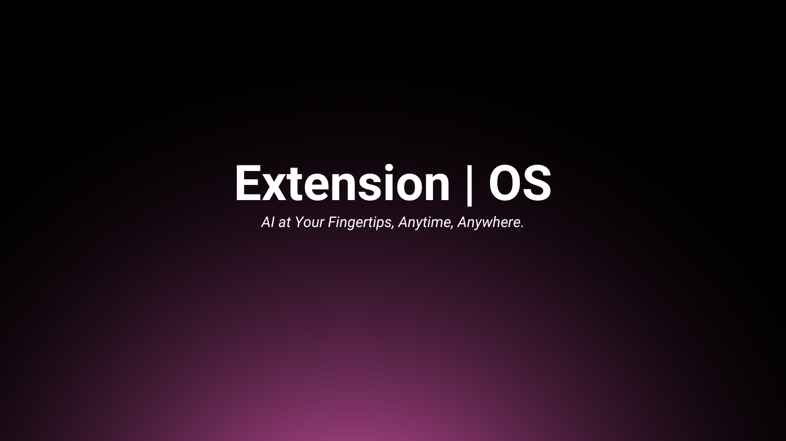
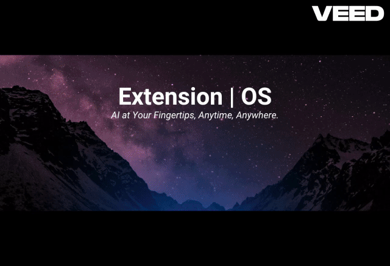
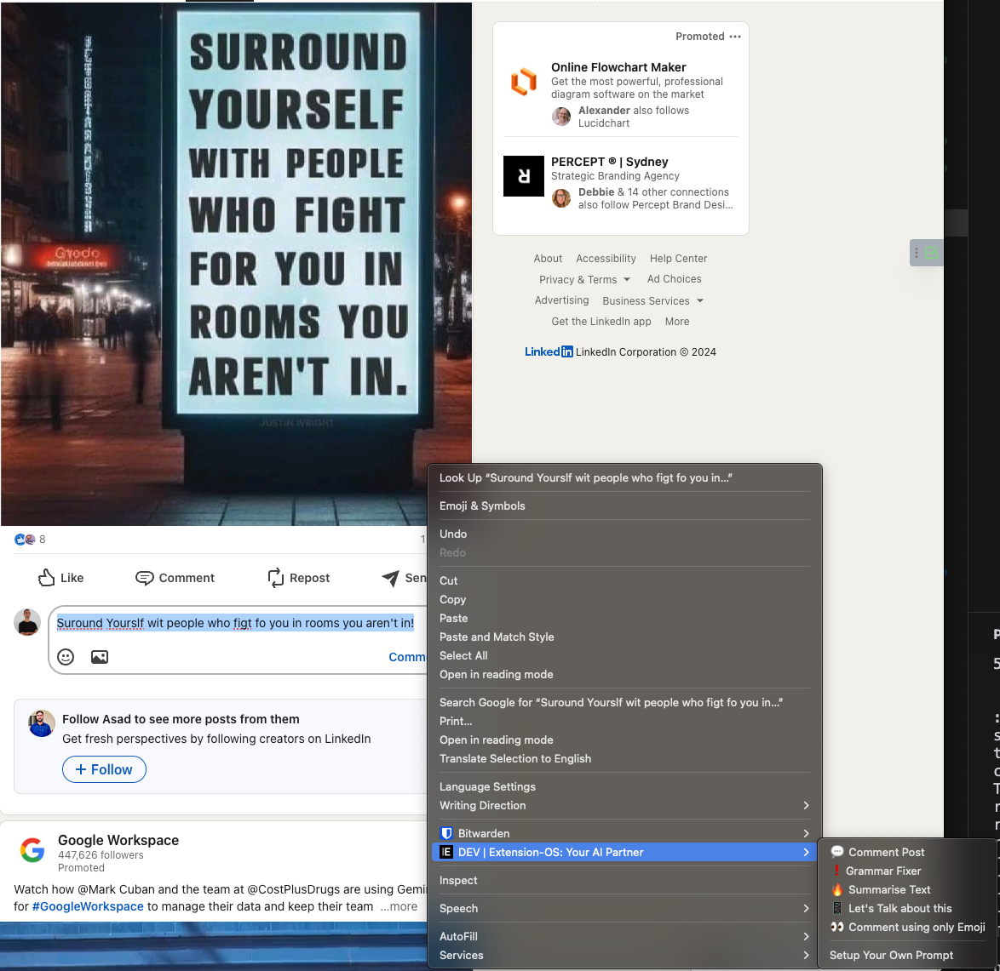
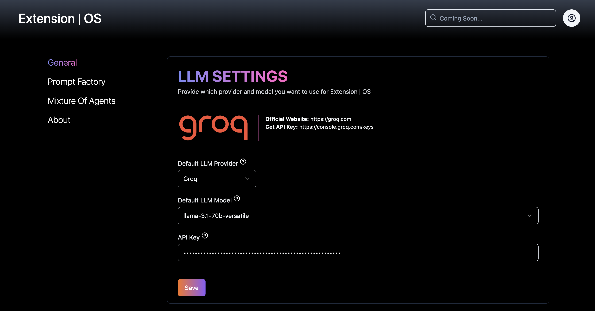
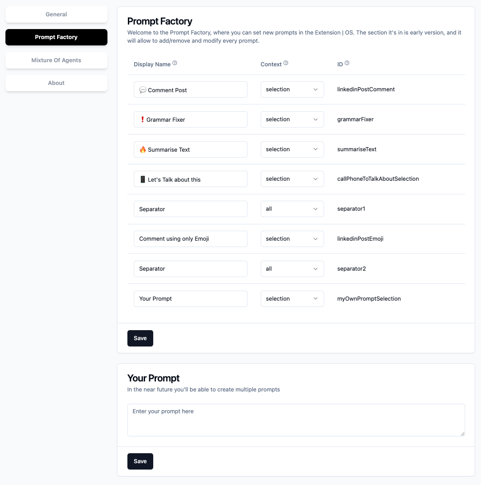
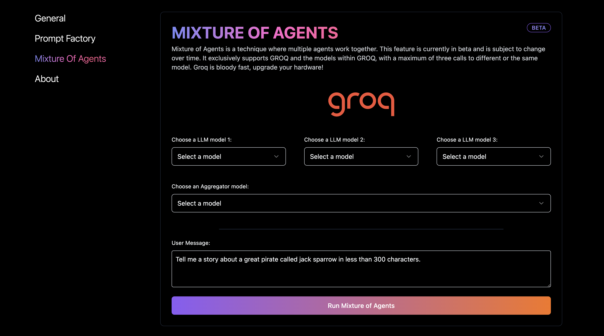

# Extension | OS



⭐️ Welcome to Extension | OS

## **Tired of the endless back-and-forth with ChatGPT, Claude, and other AI tools just to repeat the same task over and over?**

You're not alone! I felt the same frustration, so I built a solution: **Extension | OS**—an open-source browser extension that makes AI accessible directly where you need it.

**Imagine**: You create a prompt like "Fix the grammar for this text," right-click, and job done—no more switching tabs, no more wasted time.



> Imagine a world where every user has access to powerful models (LLMs and more) directly within their web browser. By integrating AI into everyday internet browsing, we can revolutionise the way people interact with information online, providing them with instant, intelligent assistance tailored to their needs.

## Pre-release on Google Chrome Store

Join an exclusive group of up to 100 early adopters and be among the first to experience the future of AI-powered browsing!

[](https://chromewebstore.google.com/detail/bahjnakiionbepnlbogdkojcehaeefnp)

[link-chrome]: https://chromewebstore.google.com/detail/bahjnakiionbepnlbogdkojcehaeefnp "Version published on Chrome Web Store"

- [][link-chrome] also compatible with [][link-chrome] [][link-chrome] [][link-chrome]

## 📸 Screenshots

Select, right-click and select the functionality—it's that easy!


Pick your favorite provider and select the model that excites you the most.


Customize your look and feel, and unleash your creativity with your own prompts!


Mixture of Agents (pre-release)
s

## Help me grow this extension

Use my affiliation code when you sign-up on VAPI: https://vapi.ai/?aff=extension-os

## 🚀 Getting started

1. Clone the extension or [download the latest release](https://github.com/albertocubeddu/extensionOS/releases/).
2. Open the Chrome browser and navigate to [chrome://extensions](chrome://extensions).
3. Enable the developer mode by clicking the toggle switch in the top right corner of the page.
4. Unpack/Unzip the `chrome-mv3-prod.zip`
5. Click on the "Load unpacked" button and select the folder you just unzipped.
6. The options page automatically opens, insert your API keys.

## ✨ Features

- **Prompt Factory**: Effortlessly Tailor Every Prompt to Your Needs with Our Standard Installation.
- **Prompt Factory**: Choose the Functionality for Every Prompt: From Copy-Pasting to Opening a New Sidebar.
- **Seamless Integration**: Effortlessly access any LLM model directly from your favorite website.
- **Secure Storage**: Your API key is securely stored in the browser's local storage, ensuring it never leaves your device.
- **[Beta] Mixture of Agents**: Experience the innovative Mixture Of Agents feature.

## Why

On the morning of July 27th, 2024, I began an exciting journey by joining the SF Hackathon x Build Club. After months of refining the concept in my mind, I decided it was time to bring it to life. I worked on enhancing my idea, updating what I had already created, and empowering everyone to unleash their creativity with custom prompts.

### Data - Awareness

All your data is stored locally on your hard drive.

#### MAC OSX

`/Users/<your-username>/Library/Application Support/Google/Chrome/Default/Sync Extension Settings/`

## Localhost

To utilize the localhost option and perform LLM inference, you must set up a local Ollama server. You can download and install Ollama along with the CLI [here](https://ollama.ai/).

### Pull Image

Example:

```
ollama pull llama3.1
```

### Start Server

Example:

```
OLLAMA_ORIGINS=chrome-extension://* ollama serve
```

**Important**: You need to configure the environment variable `OLLAMA_ORIGINS` to `chrome-extension://*` to permit requests from the Chrome extension. If `OLLAMA_ORIGINS` is not correctly configured, you will encounter an error in the Chrome extension.

**Secutity** the `*` in `chrome-extension://*` should be replaced with the extension id. If you have downloaded Extension | OS from chrome, please use `chrome-extension://bahjnakiionbepnlbogdkojcehaeefnp`

### macOS

Run `launchctl setenv` to set `OLLAMA_ORIGINS`.

```
launchctl setenv OLLAMA_ORIGINS "chrome-extension://bahjnakiionbepnlbogdkojcehaeefnp"
```

[Setting environment variables on Mac (Ollama)](https://github.com/ollama/ollama/blob/main/docs/faq.md#setting-environment-variables-on-mac)

### Docker

The Ollama server can also be [run in a Docker container](https://hub.docker.com/r/ollama/ollama). The container should have the `OLLAMA_ORIGINS` environment variable set to `chrome-extension://*`.

Run `docker run` with the `-e` flag to set the `OLLAMA_ORIGINS` environment variable:

```
docker run -e OLLAMA_ORIGINS="chrome-extension://bahjnakiionbepnlbogdkojcehaeefnp" -d -v ollama:/root/.ollama -p 11434:11434 --name ollama ollama/ollama
```

## To-Do List

Move it somewhere else ASAP:

- https://github.com/rowyio/roadmap?tab=readme-ov-file#step-1-setup-backend-template
- https://canny.io
- https://sleekplan.com/

### Urgent & Important

- [ ] **Logging**: Determine a location to store log files.

### Urgent, Not Important

- [ ] **Prompt Factory**: Add the ability to create custom prompts.
- [ ] Add the ability to chat within the browser.
- [ ] Encryption of keys : They are stored locally, nonetheless being my first chrome extension i need to research more about how this can be accessed.
- [ ] Automated Testing
- [ ] Investigate if Playwright supports Chrome extension testing.
- [ ] Automated Tagging / Release
- [ ] Locale

### Important, Not Urgent

- [ ] UI for the Prompt Factory is not intuitive and the "save all" button UX is cr@p.
- [ ] The sidebar API doesn't work after the storage API is called (User Interaction must be done)
- [ ] Move files to a `/src` folder to improve organization.
- [ ] Strategically organize the codebase structure.
- [ ] Decide on a package manager: npm, pnpm, or yarn.

### Not Urgent, Not Important

- [ ] Workflow to update the models automatically.
- [ ] **Prompt Factory**: Add the ability to build workflows.
- [ ] **Prompt Factory**: Add the option to select which LLM to use for each prompt.
- [ ] Remove all the silly comments, maybe one day....

# Youtube Video From the Hackathon

[](https://www.youtube.com/watch?v=dM1BOxVoebg)

## Footage

- [Olena from Pixabay](https://pixabay.com/users/olenchic-16658974/?utm_source=link-attribution&utm_medium=referral&utm_campaign=video&utm_content=218486)

- [NickyPe from Pixabay](https://pixabay.com/users/nickype-10327513/?utm_source=link-attribution&utm_medium=referral&utm_campaign=video&utm_content=161402)

## Music

- https://suno.com/song/f14541af-c853-4c22-b0b7-9000194fc9c6

## Voices

- ElevenLabs

# Special Thanks

- Build Club -> Hackaton Organiser
- Leonardo.ai -> Icon generated with the phoenix model
- Canva -> The other images not generated with AI
- ShadCn -> All the UI?
- Plasmo -> The Framework
- Groq -> Extra credits
- Icons -> icons8
- https://shadcnui-expansions.typeart.cc/

# Changelog

### 0.0.25

- Adding new llama3.3
- Adding instruction for install ollama on the UI

### 0.0.24

- Adding the ability to specify a custom URL

### 0.0.23

- Adding the uninstall hook to understand what can we improve.

### 0.0.22

- Fixed the X,Y positioning in page like LinkedIn, Reddit and so on.
- The declarativeNetRequest has been removed to enhance the release lifecycle in light of Chrome Store authorization requirements. Ollama continue to be fully supported, and detailed configuration instructions can be found in the README.

### 0.0.21

- Chaged the introductory GIF demonstrating how to use the Extension | OS.
- PromptFactory: Implemented a notification to inform users that any selected text will be automatically appended to the end of the prompt.
- Settings: Using Switch vs CheckBoxes
- Implemented optional (disabled by default) anonymous tracking to monitor usage patterns, including the most frequently used models and vendors.

### 0.0.20

- SelectionMenu: Now accessible on Reddit as well! (Consider prefixing all Tailwind classes for consistency)
- PromptSelector: Resolved all React warnings for a smoother experience
- Verified that pre-selection functions correctly (Thanks to E2E testing)

### 0.0.19

- Added more instruction for ollama
- localhost: Add the ability to specify the model by input text (vs select box)
- Fixed a useEffect bug

### 0.0.18

- SelectionMenu: Now you can choose to enable/disable
- SelectionMenu: When a key is pressed (e.g backspace for remove, or CTRL/CMD + C for copying) the menu automatically disappear

### 0.0.17

- Development: Integrated Playwright for testing and added a suite of automated tests

### 0.0.16

- SelectionMenu: Fixed a bug that caused the menu to vanish unexpectedly after the onMouseUp event, leading to confusion regarding item selection for users.
- SelectionMenu: Adjusted the visual gap to provide more space to the user.
- UI: Eliminated the conflicting success/loading state for a clearer user experience.

### 0.0.15

- SelectionMenu: Refined the triggering mechanism for improved responsiveness.
- SelectionMenu: Reduced the size for a more compact design.
- SelectionMenu: Automatically refreshes items immediately after the user updates the prompts.

### 0.0.14

- Fixed grammar issues, thanks to Luca.
- Introduced a new menu, courtesy of Denis.
- The new menu currently does not support phone calls (feature coming soon).

### 0.0.13

- Enhanced UI (tooltips are now more noticeable) thanks to Juanjo (We Move Experience) and Agostina (PepperStudio)
- Prompt Factory: Utilizing AutoTextArea for improved prompt display
- Prompt Factory: Removed the ID to improve user experience (non-tech users)
- System: Split the systemPrompt from the userPrompt.
- UX: Small improvements and removed the complicated items

### 0.0.12 (Not released to the public)

- General: Free tier exhaustion. We haven't got a sponsor (yet) to support our community users.
- Google: Added identity, identity.email to enable automatic log-in using your google credentials.

### 0.0.11 (Not released to the public)

- General: Introduced a FREE Tier for users to explore the Extension | OS without needing to understand API Keys.
- Development: Implemented the CRX Public Key to maintain a consistent extension ID across re-installations during development.
- Development: Integrated OAUTH for user authentication when accessing the FREE tier.
- Permissions: Added identity permissions to facilitate user identity retrieval.
- Showcase: Updated images for improved visual presentation.
- Prompt Factory: Set Extension | OS as the default model, enabling users to utilize the extension without prior knowledge of API Key setup.

### 0.0.10

- Context Menu: Added a new right-click option for seamless access to configuration settings.
- Context Menu: Improved the layout and organization of the context menu for enhanced user experience.
- Prompt Factory: Introduced a comprehensive sheet that details the context and functionality of each feature.
- Prompt Factory: Implemented a clickable icon to indicate that the tooltip contains additional information when clicked.

### 0.0.9

- Bug fixes
- Clean up codebase
- UX for the functionality improved

### 0.0.8

- Removed an unnecessary dependency to comply with Chrome Store publication guidelines.
- Introduced a new icon.
- Implemented a loading state.
- Fixed an issue where Reddit visibility was broken.

### 0.0.7

- Adding missing models from together.ai
- Adding missing models from groq
- Updated About page
- **MoA**: Add the ability to use a custom prompt.

### 0.0.6

- Popup: UI revamped
- Popup: New Presentation image and slogan
- Options: Unified fonts
- Options: Minor UI updates
- Content: Better error handling and UX (user get redireted to the option page when the API key is missing)
- Fix for together.ai (it was using a non-chat model)

## 0.0.5

- Vapi affilation link (help me maintain this extension, sign up with the link)
- Vapi Enhancements: Prompts now support selecting a specific phone number to call.
- Vapi Enhancements: Prompts can now include a custom initial message for the conversation.
- Vapi Enhancements: Now every prompt can be customised using the
- UI: Section for specific configurations

## 0.0.4

- Hotfix: declarativeNetRequest was intercepting every localhost request.

## 0.0.3

- Added github branch protection.
- Changed the datastructure to achieve a clearer and more abstract way to call functions
- Function to clean the datastructure to adapt to chrome.contextMenus.CreateProperties
- use "side\_" as hack to open the sidebar. WHY: The sidebar.open doesn't work after we call the storage.get
- Allowing to change the default prompts
- chrome.runtime.openOptionsPage() opens only in production environment (onInstalled)
- Improved UI (switched to dark theme)
- Allowing to change the functionality; The "side\_" bug is annoying as it is over complicating the codebase.

## 0.0.2

- How to install and start polishing the repository

## 0.0.1

- Check the demo video

# Gotchas

- Ensure that the open.sidePanel is always initialized before the Plasmo Storage.
- We currently have two menus that function similarly but not identically; we need to implement a more efficient solution to consolidate them into one.
- The Plasmo handler may stop functioning unexpectedly without errors if a response is not returned; ensure to always return a response to prevent this issue.
